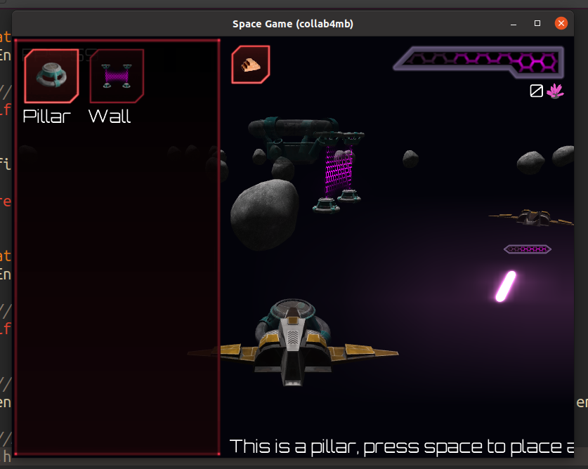

# screenshot


# Space Game
In Space Game, you maneuver a 3D space ship across a 2D plane. Waves of other ships will periodically arrive to attack you. To help ward them off, you can construct walls and other defenses using materials harvested from stray asteroids and defeated enemies.

# To run
### Linux
Some dev packages for opening X11 windows and using OpenGL are necessary.
You can grab all of them with `sudo apt-get install libgl-dev libx11-dev libxi-dev libxcursor-dev`.
You should only need to download them once. Afterwards, to build and run the project, run `./bake && build/a.out` in the project root.
### Windows
On Windows, run `bake.bat` and then `build/main.exe`.


# Bikeshedding
### Casing
Functions and variables are `snake_case`.
Structs and Enums are `PascalCase`d, and `typedef`ed such that you do `MyStruct`, not `struct MyStruct`.
### Namespacing
Prefer [unity builds (aka jumbo builds)](https://en.wikipedia.org/wiki/Unity_build) where possible.

The entry point of the program is `main.c`; all other files are `.h` files which are `#include`d into `main.c`.

Inside of unity build headers, namespace with a prefix that matches the name of the `.h` file. Functions private to this header should be prefixed again with `_`, such that if your file is `mapgen.h`, the private function `simplex_noise` becomes `_mapgen_simplex_noise`.
### Spacing
Configure your editor to emit two spaces when the tab key is pressed. No actual tab characters should be included in any commits.
### Syntax
Don't use `{}` for single statement blocks following `if`/`while` / `for` etc.
This means that instead of:
```c
for (int x = 0; x < MAX; x++) {
  for (int y = 0; y < MAX; y++) {
    for (int z = 0; z < MAX; z++) {
      place_cube((Cube) { x, y, z });
    }
  }
}
```
you have simply:
```c
for (int x = 0; x < MAX; x++)
  for (int y = 0; y < MAX; y++)
    for (int z = 0; z < MAX; z++)
      place_cube((Cube) { x, y, z });
```


# Dependencies
Space Game uses `sokol` for cross-platform system abstractions, because SDL2 is a pain to compile, and doesn't abstract over graphics APIs.

You don't need to install anything, it's copied into the sokol/ folder.

Writing our own cross-platform abstractions might make sense since collectively we have more than enough hardware to test on, but I'd rather make a game, not an ~~engine~~ cross-platform abstraction layer.
